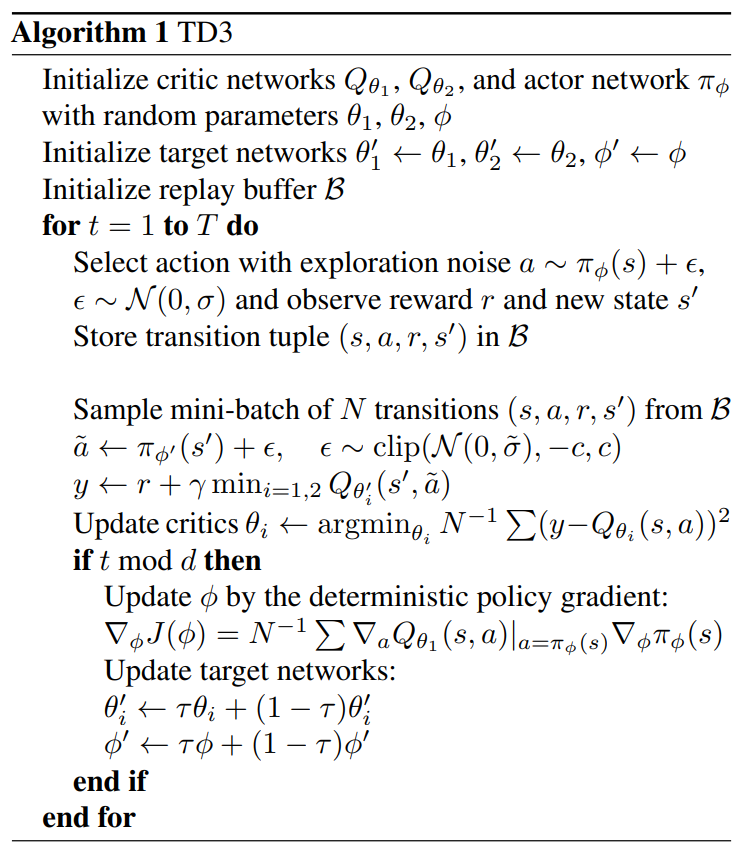
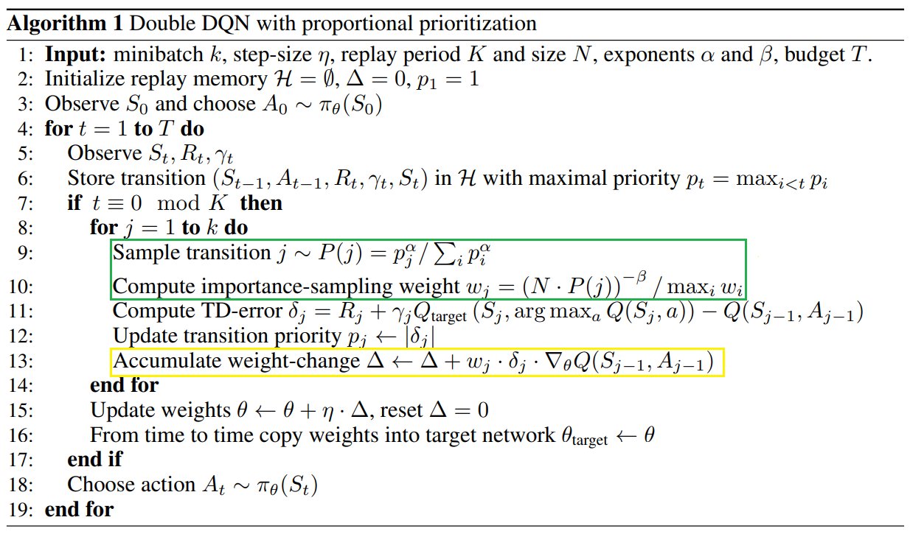

# Learning Algorithm
The Reinforcement Learning algorithm used to **solve** the environment was [Twin Delayed Deep Deterministic policy gradient (TD3)](https://arxiv.org/abs/1802.09477)



To achieve better results, the algorithm was customized to address the problem and introduced the use of [Prioritized Experience Replay (PER)](https://arxiv.org/abs/1511.05952)



* The Prioritized Experience Replay (PER) is inside the DQN algorithm as in the original paper. The PER algorithm parts are in __Green__ and __Yellow__.
* The __Green__ part was used as is without needing any customization.
* The __Yellow__ part was applied only to the errors of the Twin Critics and not toe the Policy errors because it worsen its results.

## Model
```
Agent 0 - Actor Local TD3 -> Actor(
  (l1): Linear(in_features=24, out_features=400, bias=True)
  (l2): Linear(in_features=400, out_features=300, bias=True)
  (l3): Linear(in_features=300, out_features=2, bias=True)
)
Agent 0 - Actor Target TD3 -> Actor(
  (l1): Linear(in_features=24, out_features=400, bias=True)
  (l2): Linear(in_features=400, out_features=300, bias=True)
  (l3): Linear(in_features=300, out_features=2, bias=True)
)
Agent 0 - Twin Critic Local TD3 -> TwinCritic(
  (l1): Linear(in_features=26, out_features=400, bias=True)
  (l2): Linear(in_features=400, out_features=300, bias=True)
  (l3): Linear(in_features=300, out_features=1, bias=True)
  (l4): Linear(in_features=26, out_features=400, bias=True)
  (l5): Linear(in_features=400, out_features=300, bias=True)
  (l6): Linear(in_features=300, out_features=1, bias=True)
)
Agent 0 - Twin Critic Target TD3 -> TwinCritic(
  (l1): Linear(in_features=26, out_features=400, bias=True)
  (l2): Linear(in_features=400, out_features=300, bias=True)
  (l3): Linear(in_features=300, out_features=1, bias=True)
  (l4): Linear(in_features=26, out_features=400, bias=True)
  (l5): Linear(in_features=400, out_features=300, bias=True)
  (l6): Linear(in_features=300, out_features=1, bias=True)
)
Agent 1 - Actor Local TD3 -> Actor(
  (l1): Linear(in_features=24, out_features=400, bias=True)
  (l2): Linear(in_features=400, out_features=300, bias=True)
  (l3): Linear(in_features=300, out_features=2, bias=True)
)
Agent 1 - Actor Target TD3 -> Actor(
  (l1): Linear(in_features=24, out_features=400, bias=True)
  (l2): Linear(in_features=400, out_features=300, bias=True)
  (l3): Linear(in_features=300, out_features=2, bias=True)
)
Agent 1 - Twin Critic Local TD3 -> TwinCritic(
  (l1): Linear(in_features=26, out_features=400, bias=True)
  (l2): Linear(in_features=400, out_features=300, bias=True)
  (l3): Linear(in_features=300, out_features=1, bias=True)
  (l4): Linear(in_features=26, out_features=400, bias=True)
  (l5): Linear(in_features=400, out_features=300, bias=True)
  (l6): Linear(in_features=300, out_features=1, bias=True)
)
Agent 1 - Twin Critic Target TD3 -> TwinCritic(
  (l1): Linear(in_features=26, out_features=400, bias=True)
  (l2): Linear(in_features=400, out_features=300, bias=True)
  (l3): Linear(in_features=300, out_features=1, bias=True)
  (l4): Linear(in_features=26, out_features=400, bias=True)
  (l5): Linear(in_features=400, out_features=300, bias=True)
  (l6): Linear(in_features=300, out_features=1, bias=True)
)
```

## Hyperparameters used for training

* TOTAL_EPISODES: 500

* EXPLORATION_NOISE: 0.1 (Noise Scale added to each predicted action from the agents)
* WARMUP_TIMESTEPS: 1000 or 1024 (Number of steps before training starts. For faster convergence and more stable results after solving: __Ubuntu 16.04__: 1000. __Windows 10__: 1024)
* UPDATES_PER_STEP: 4 (Number of updates of the neural networks per timestep)

* BUFFER_SIZE: 1.000.000
* BATCH_SIZE: 1000 or 1024 (for faster convergence and more stable results after solving: __Ubuntu 16.04__: 1000. __Windows 10__: 1024)
* GAMMA: .99 (discount factor)
* TAU: 5e-2 (soft update from local actor and critic network parameters to their respective target network parameters)
* LR_ACTOR: 1e-3 (Actor local learning rate)
* LR_CRITIC: 1e-3 (Critic local learning rate)
* POLICY_UPDATE_FREQUENCY: 2 (Policies are updated __UPDATES_PER_STEP/POLICY_UPDATE_FREQUENCY__ times for each timestep and the Twin Critics are updated are updated __UPDATES_PER_STEP__ times for each timestep)
* POLICY_NOISE: 0.2 (Noise Scale added to the learning process of the agents)
* NOISE_CLIP: 0.5 (Noise clipping to the POLICY_NOISE)

* prob_alpha: 0.6 (Alpha determines how much prioritization is used)
* beta: 0.4 (Importance-sampling correction exponent)
* EPSILON: 1e-5 (Small positive constant that prevents transitions not being revisited once their error is zero in the Prioritized Experience Replay)


# Plot of Rewards

# Ideas for Future Work

